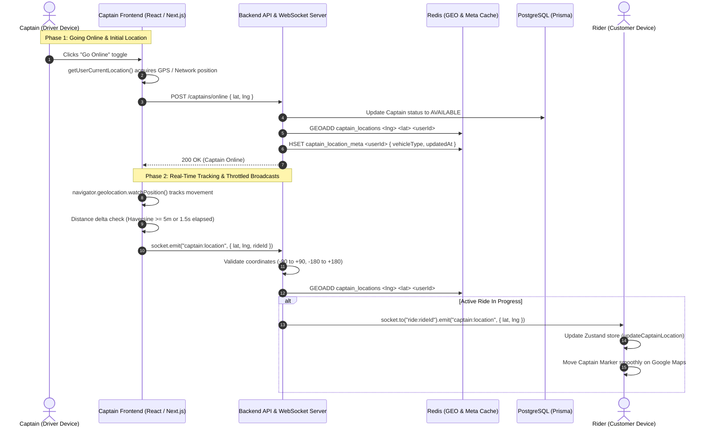

# Captain Live Location Architecture & Real-Time Telemetry Flow

This document provides a comprehensive technical breakdown of how the **Captain Live Location** system works across the entire Tripzo / Rapido codebase—from hardware sensor acquisition on mobile or desktop devices, through real-time WebSockets and Redis Geospatial indexing, to ride matching and live map updates on the Rider's screen.

---

## 1. High-Level Telemetry Architecture



---

## 2. Phase-by-Phase Technical Walkthrough

### Phase 1: Client-Side Location Acquisition (Captain Device)

The client acquisition layer lives in:

- [geolocation.service.ts](file:///e:/Main-Projects/rapido/frontend/app/lib/location/geolocation.service.ts)
- [useCaptainSocket.ts](file:///e:/Main-Projects/rapido/frontend/app/hooks/useCaptainSocket.ts)
- [CaptainPage.tsx](<file:///e:/Main-Projects/rapido/frontend/app/app/(dashboard)/captain/page.tsx>)

#### 1. Proactive Location Pre-Fetch

When a captain opens the Captain Cockpit, the dashboard proactively calls `getUserCurrentLocation()` to pinpoint the driver's current coordinates immediately—ensuring the map centers on the driver right away, without waiting for the online toggle.

#### 2. Multi-Tier Location Resolver

Mobile browsers enforce security restrictions: **`navigator.geolocation` is blocked on insecure HTTP origins** (e.g., accessing via `http://192.168.0.101:3000` on a phone on local Wi-Fi). To make testing and production work anywhere, the system uses a **3-tier strategy**:

1. **Tier 1 (Device Hardware GPS):**
   Calls `navigator.geolocation.getCurrentPosition(...)` with `enableHighAccuracy: true`, 5-second timeout. If the app is on `localhost`, `127.0.0.1`, or HTTPS, this returns sub-meter GPS hardware accuracy.
2. **Tier 2 (High-Speed Network/IP Fallback):**
   If Tier 1 fails with `PERMISSION_DENIED`, origin insecurity, or timeout, the service automatically requests high-speed IP geolocation (`https://ipwho.is/` with fallback to `http://ip-api.com/json/`). This accurately identifies the user's city/region (e.g. Delhi NCR) in under 250ms.
3. **Tier 3 (Google Maps Reverse Geocoding):**
   The raw `(lat, lng)` is passed to `google.maps.Geocoder` to resolve the exact locality and formatted street address.

---

### Phase 2: Going Online & Instant Redis Registration

When the captain taps the **STATUS: ONLINE** switch in [CaptainPage.tsx](<file:///e:/Main-Projects/rapido/frontend/app/app/(dashboard)/captain/page.tsx>):

```ts
const handleOnlineToggle = async (checked: boolean) => {
  setTogglingOnline(true);
  try {
    if (checked) {
      // 1. FIRST get the current location of the captain
      const loc = await getUserCurrentLocation(true);
      setCaptainLocation({ lat: loc.lat, lng: loc.lng });

      // 2. Call backend to set online with the acquired coordinates
      await captainService.setOnline({ lat: loc.lat, lng: loc.lng });
      setOnline(true);

      // 3. Immediately emit location via WebSocket
      const socket = socketClient.getSocket();
      if (socket?.connected && loc) {
        socket.emit("captain:location", {
          lat: loc.lat,
          lng: loc.lng,
          timestamp: Date.now(),
        });
      }
    } else {
      await captainService.setOffline();
      setOnline(false);
    }
  } finally {
    setTogglingOnline(false);
  }
};
```

#### Backend Dual-Path Registration:

In [captain.controller.ts](file:///e:/Main-Projects/rapido/backend/src/controllers/captain.controller.ts) and [captain.service.ts](file:///e:/Main-Projects/rapido/backend/src/services/captain.service.ts):

1. **PostgreSQL**: Sets `Captain.status = AVAILABLE`.
2. **Redis Geospatial Index**:
   ```ts
   await redisClient.geoAdd("captain_locations", {
     member: userId,
     latitude: lat,
     longitude: lng,
   });
   await redisClient.hSet(
     "captain_location_meta",
     userId,
     JSON.stringify({
       vehicleType: updatedCaptain.vehicleType,
       updatedAt: Date.now(),
     }),
   );
   ```
   This ensures the captain is **immediately searchable** for ride dispatches from millisecond zero.

---

### Phase 3: Continuous Real-Time Tracking & Throttling

Continuous movement is tracked using `navigator.geolocation.watchPosition` in [useCaptainSocket.ts](file:///e:/Main-Projects/rapido/frontend/app/hooks/useCaptainSocket.ts):

```ts
watchId = navigator.geolocation.watchPosition(handleSuccess, handleError, {
  enableHighAccuracy: true,
  maximumAge: 1000,
  timeout: 10000,
});
```

#### Battery & Network Throttling (Haversine Delta Check)

To avoid overwhelming the server with hundreds of GPS events per second while moving in stop-and-go traffic:

- **Time Threshold:** Emits if $\ge 1500\text{ ms}$ have passed.
- **Distance Threshold:** Emits if $\ge 800\text{ ms}$ have passed **AND** the driver moved $\ge 5\text{ meters}$ (calculated using the Haversine formula).

```ts
const distanceMoved = getDistanceMeters(
  lastPos.lat,
  lastPos.lng,
  latitude,
  longitude,
);
const shouldEmit =
  !lastPos ||
  now - lastEmit >= 1500 ||
  (now - lastEmit >= 800 && distanceMoved >= 5);
```

---

### Phase 4: WebSocket Ingestion & Active Ride Broadcasting

When the backend receives `captain:location` in [socket.ts](file:///e:/Main-Projects/rapido/backend/src/socket.ts):

```ts
socket.on("captain:location", async (data) => {
  const { rideId, lat, lng, timestamp } = data;

  // 1. Strict Coordinate Validation
  if (
    !Number.isFinite(lat) ||
    !Number.isFinite(lng) ||
    lat < -90 ||
    lat > 90 ||
    lng < -180 ||
    lng > 180
  ) {
    return;
  }

  // 2. Update Redis Geospatial Index
  await redisClient.geoAdd("captain_locations", {
    member: user.userId,
    latitude: lat,
    longitude: lng,
  });

  // 3. Forward to Active Ride Room (if assigned)
  if (targetRideId) {
    io.to(`ride:${targetRideId}`).emit("captain:location", {
      lat,
      lng,
      timestamp,
    });
  }
});
```

---

### Phase 5: How the Rider Sees the Captain Live

The rider's application listens via [useRiderSocket.ts](file:///e:/Main-Projects/rapido/frontend/app/hooks/useRiderSocket.ts) and renders in [MapContainer.tsx](file:///e:/Main-Projects/rapido/frontend/app/components/map/MapContainer.tsx):

1. **Room Subscription:**
   When a ride is active, the rider client joins the room `socket.emit("join_ride", rideId)`.
2. **Receiving GPS Ticks:**
   ```ts
   socket.on("captain:location", (data) => {
     updateCaptainLocation(data.lat, data.lng);
   });
   ```
3. **Map Marker & Dynamic Navigation:**
   - **Phase A (Captain Arriving):**
     - The map displays a live yellow bike/car SVG marker at `activeRide.captainLocation`.
     - The driving directions polyline dynamically draws from **Captain $\rightarrow$ Rider Pickup**.
   - **Phase B (Trip In Progress):**
     - The driving directions polyline dynamically draws from **Captain/Pickup $\rightarrow$ Final Destination**.
     - The top telemetry bar shows: `Captain is Live on GPS (lat, lng)`.

---

### Phase 6: How Ride Matching Uses the Captain's Location

When a rider requests a ride or a scheduled ride dispatches at $T-15\text{ min}$, the matching engine in [ride.service.ts](file:///e:/Main-Projects/rapido/backend/src/services/ride.service.ts) queries Redis using geospatial radius search:

```ts
// Search Redis for all captains within 10 km of rider pickup
const nearby = await redisClient.geoSearch(
  "captain_locations",
  { latitude: pickupLat, longitude: pickupLng },
  { radius: 10, unit: "km" },
);
```

Only captains who:

1. Are currently `AVAILABLE` in PostgreSQL,
2. Have a live position in Redis within radius,
3. Match the requested `vehicleType` (BIKE, AUTO, CAB),
4. Have not previously rejected this ride,
   receive the incoming `ride:new` alert with a 15-second countdown.

---

### Phase 7: Going Offline & Cleanup

When the captain toggles **STATUS: OFFLINE**:

1. Client stops the browser watcher: `navigator.geolocation.clearWatch(watchId)`.
2. Client disconnects the socket: `socketClient.disconnect()`.
3. Backend cleans up Redis keys:
   ```ts
   await redisClient.zRem("captain_locations", userId);
   await redisClient.hDel("captain_location_meta", userId);
   ```
4. This ensures that offline captains **never receive accidental ride alerts** and do not consume Redis memory.

---

## 3. Key Source Code Files Reference

| Area                  | File Path                                                                                                        | Key Functionality                                             |
| :-------------------- | :--------------------------------------------------------------------------------------------------------------- | :------------------------------------------------------------ |
| **Location Service**  | [`geolocation.service.ts`](file:///e:/Main-Projects/rapido/frontend/app/lib/location/geolocation.service.ts)     | 3-tier GPS/IP/Geocoder fallback logic                         |
| **Captain Telemetry** | [`useCaptainSocket.ts`](file:///e:/Main-Projects/rapido/frontend/app/hooks/useCaptainSocket.ts)                  | Real-time GPS watch, delta throttling, socket emits           |
| **Captain UI**        | [`CaptainPage.tsx`](<file:///e:/Main-Projects/rapido/frontend/app/app/(dashboard)/captain/page.tsx>)             | "Go Online" button, pre-mount location check                  |
| **Captain Map**       | [`CaptainMapContainer.tsx`](file:///e:/Main-Projects/rapido/frontend/app/components/map/CaptainMapContainer.tsx) | Turn-by-turn navigation HUD, Google Maps launcher             |
| **Socket Ingestion**  | [`socket.ts`](file:///e:/Main-Projects/rapido/backend/src/socket.ts)                                             | Ingests `captain:location`, updates Redis, broadcasts to ride |
| **Captain Backend**   | [`captain.service.ts`](file:///e:/Main-Projects/rapido/backend/src/services/captain.service.ts)                  | Manages `AVAILABLE`/`OFFLINE` state and Redis GEO indexing    |
| **Rider Telemetry**   | [`useRiderSocket.ts`](file:///e:/Main-Projects/rapido/frontend/app/hooks/useRiderSocket.ts)                      | Receives live coordinates and updates ride store              |
| **Rider Map**         | [`MapContainer.tsx`](file:///e:/Main-Projects/rapido/frontend/app/components/map/MapContainer.tsx)               | Renders moving captain marker and arrival polyline            |
