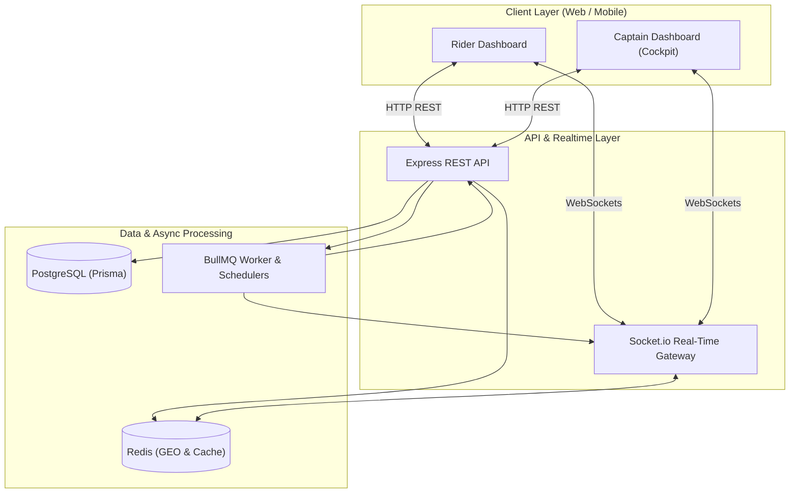
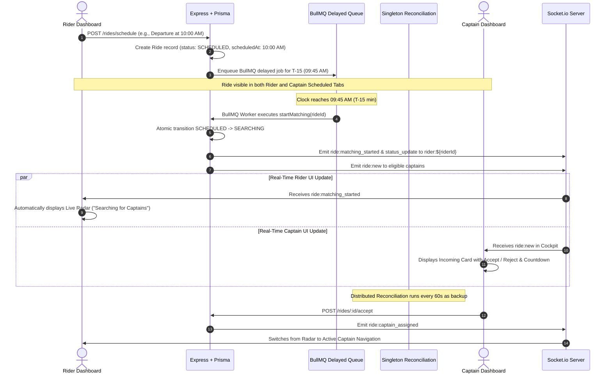

# Tripzo (Rapido Clone) — Full Codebase Architecture, Feature Inventory & Future Roadmap

> **Document Version:** 1.0.0  
> **Last Updated:** September 17, 2026  
> **Target Audience:** Engineering Team, Technical Reviewers, and Architects  
> **Location:** Project Root (`/CODEBASE_FLOW_AND_FEATURES_GUIDE.md`)

---

## 1. Executive Summary & Technology Stack

**Tripzo** is a full-stack, enterprise-grade ride-hailing platform architected for ultra-fast on-demand matching, high-precision geospatial tracking, and robust advance ride reservations. Built with distributed-systems principles, it prevents race conditions, eliminates stale state transitions, and synchronizes state in real time across Rider and Captain (Driver) clients.

### Core Technology Stack

| Layer | Technologies Used | Key Responsibilities |
|---|---|---|
| **Frontend Framework** | Next.js 16 (App Router), React 19, TypeScript | Server & Client components, responsive layout, dynamic routing |
| **Styling & UI** | Vanilla Tailwind CSS, Lucide React icons, Google Material Symbols | High-contrast dark/slate theme, custom telemetry cards, micro-animations |
| **State Management** | Zustand (Client-side decoupled stores) | `useRideStore`, `useCaptainStore`, `useAuthStore` |
| **Maps & Geospatial** | Google Maps JavaScript API, `@react-google-maps/api` | Custom map styling, dynamic routing, Geocoding, Places Autocomplete |
| **Backend Runtime** | Node.js, Express, TypeScript | REST APIs, route controllers, middleware validation |
| **Database & ORM** | PostgreSQL (Neon Cloud DB), Prisma ORM | Relational data persistence, interactive ACID transactions, schema migrations |
| **Real-Time Layer** | Socket.io (WebSockets) | Bi-directional streaming for ride assignments, GPS tracking, and status events |
| **Cache & Geospatial** | Redis (Upstash Redis) | Real-time geospatial indexing (`GEOADD`, `GEORADIUS`), active assignment caching |
| **Job Queue & Scheduling** | BullMQ with Redis | Delayed jobs for advance scheduled dispatch ($T-15\text{ min}$), fallback cancellation timers, distributed reconciliation |
| **Validation & Security** | Zod, JSON Web Tokens (JWT), bcrypt | Input sanitization, token rotation via HttpOnly cookies and Bearer headers |

---

## 2. Complete End-to-End System Flows

The codebase is built around two primary execution paths: **Immediate On-Demand Rides** and **Advance Scheduled Rides ($T-15\text{ min}$ Dispatch)**.



---

### 2.1. Immediate On-Demand Ride Flow

1. **Fare Estimation**:
   - Rider enters pickup and destination coordinates (via Google Places Autocomplete or GPS).
   - Frontend calls `GET /rides/fare?pickupLat=...&pickupLng=...&destinationLat=...&destinationLng=...&vehicleType=...`.
   - Backend calculates Haversine/Google distance, applies base fare, per-km rate, per-minute rate, and dynamic vehicle multiplier (`BIKE`, `AUTO`, `CAB`).
2. **Ride Creation (`POST /rides`)**:
   - Backend creates a `Ride` record in PostgreSQL with status `SEARCHING`.
   - Enqueues a fallback cancellation job in BullMQ (`cancelIfNoAssignment`, 2-minute delay).
3. **Geospatial Captain Discovery**:
   - Backend queries Redis Geospatial index `captain_locations` using `GEORADIUS` within a configurable radius (5 km in production, 50 km in local development).
   - Filters out captains who are `OFFLINE`, on an existing ride (`ON_RIDE`), or have previously rejected this specific ride ID (`RideRejection`).
   - Development fallback: If Redis GEO is empty, queries PostgreSQL for online `AVAILABLE` captains.
4. **WebSocket Broadcast**:
   - Emits `ride:new` to each eligible captain's private personal room: `captain:${captainUserId}`.
   - Emits `ride:status_update` to rider's private room: `rider:${riderId}`.
5. **Captain Review & Acceptance (`POST /rides/:id/accept`)**:
   - Captain receives the request in Cockpit with a countdown timer, locked fare, and waypoint details.
   - Captain clicks **Accept Ride**.
   - Backend executes an atomic interactive transaction in PostgreSQL:
     - Updates Captain status to `ON_RIDE`.
     - Updates Ride status to `CAPTAIN_ASSIGNED`, assigns `captainId`, and increments optimistic `version`.
   - Cancels the BullMQ 2-minute fallback timeout job.
   - Caches `ride_assignment:${captainUserId}` in Redis.
   - Emits `ride:captain_assigned` to `ride:${rideId}` and directly to `rider:${riderId}`.
6. **Ride Execution Milestones**:
   - **Captain Arriving / Arrived**: Captain clicks "Arrived at Pickup" -> `POST /rides/:id/arrived` -> status transitions to `CAPTAIN_ARRIVED`. Emits `ride:captain_arrived`.
   - **Trip Start**: Captain verifies the 4-digit start PIN provided by the rider -> `POST /rides/:id/start` -> status transitions to `IN_PROGRESS`. Emits `ride:started`.
   - **Trip Completion**: Captain drops rider at destination -> `POST /rides/:id/complete` -> status transitions to `COMPLETED`. Updates Captain status back to `AVAILABLE`. Emits `ride:completed`.

---

### 2.2. Advance Scheduled Ride Flow (Signature Architecture)

Advance bookings allow riders to secure rides up to 7 days ahead, with guaranteed dispatch beginning **15 minutes before the actual departure time ($T-15\text{ min}$)**.



#### Key Architecture Safeguards Implemented:
1. **No-Disappearance Guarantee**: Captain scheduled queries fetch `status: { in: [SCHEDULED, SEARCHING] }`. When status changes to `SEARCHING`, the ride does **not** vanish from the Captain's scheduled reservations list.
2. **Pulsing Badge & 1-Click CTAs**:
   - Both Captain and Rider scheduled cards render a pulsing **`⚡ DISPATCHING NOW`** badge.
   - Captain tab offers **`Claim in Cockpit ➔`** (switches to Cockpit with active request card).
   - Rider tab offers **`Track Live Search ➔`** (switches to Live Radar searching view).
3. **No Premature 2-Minute Cancellation**: For scheduled rides, `cancelIfNoAssignment` timeout is calculated dynamically as `Math.max(10 * 60 * 1000, scheduledTime - now)`, keeping matching active until actual departure.
4. **Distributed-Safe Reconciliation Singleton**: A BullMQ recurring scheduler runs every 60 seconds (with an immediate sweep on boot) to discover any scheduled rides within 15 minutes that missed job execution due to network blips or server restarts.

---

## 3. Detailed Inventory of Features Built Till Now

### 3.1. Backend Features

#### 1. Data Modeling & Database (`backend/prisma/schema.prisma`)
- **`User` Model**: Multi-role support (`RIDER`, `CAPTAIN`, `ADMIN`), phone, email, bcrypt-hashed passwords.
- **`Captain` Model**: Vehicle type (`BIKE`, `AUTO`, `CAB`), vehicle model, license plate number, status (`OFFLINE`, `AVAILABLE`, `ON_RIDE`), rating, total trips.
- **`Ride` Model**:
  - Full GPS coordinates (`pickupLat`, `pickupLng`, `destinationLat`, `destinationLng`).
  - Human-readable street names and full addresses (`pickupName`, `pickupAddress`, `destinationName`, `destinationAddress`).
  - Metrics: `estimatedDistanceM`, `estimatedDurationS`, `estimatedFare`, `finalFare`.
  - Comprehensive status state machine: `SCHEDULED`, `SEARCHING`, `CAPTAIN_ASSIGNED`, `CAPTAIN_ARRIVING`, `CAPTAIN_ARRIVED`, `IN_PROGRESS`, `COMPLETED`, `CANCELLED`.
  - Audit timestamps: `scheduledAt`, `assignedAt`, `startedAt`, `completedAt`, `cancelledAt`.
  - Optimistic concurrency control via `version: Int @default(0)`.
- **`RideRejection` Model**: Uniqueness constraint `[rideId, captainId]` preventing spamming captains with requests they previously declined.
- **`RefreshSession` Model**: Persistent refresh token management for secure session rotation.

#### 2. REST API Endpoints

| Category | Method & Path | Auth / Role | Description |
|---|---|---|---|
| **Auth** | `POST /auth/register` | Public | Register new Rider or Captain |
| **Auth** | `POST /auth/login` | Public | Authenticate user, issue JWT access & refresh tokens |
| **Auth** | `POST /auth/refresh` | Public | Rotate refresh token and issue new access token |
| **Auth** | `POST /auth/logout` | Authenticated | Invalidate refresh session and clear cookies |
| **Auth** | `GET /auth/me` | Authenticated | Fetch current authenticated user profile |
| **Rides** | `GET /rides/fare` | Authenticated | Calculate estimated fare, distance, and duration |
| **Rides** | `POST /rides` | Rider | Create immediate on-demand ride |
| **Rides** | `POST /rides/schedule` | Rider | Reserve an advance scheduled ride ($> 15\text{ min}$) |
| **Rides** | `GET /rides/scheduled` | Rider | Get all upcoming scheduled rides for current rider |
| **Rides** | `GET /rides/active` | Rider | Fetch current ongoing or dispatching ride for rider |
| **Rides** | `GET /rides/:rideId` | Authenticated | Get full details of a specific ride with live GPS |
| **Rides** | `POST /rides/:rideId/cancel` | Authenticated | Cancel ride (with automatic state rollback) |
| **Rides** | `POST /rides/:rideId/accept` | Captain | Concurrency-safe atomic ride acceptance |
| **Rides** | `POST /rides/:rideId/reject` | Captain | Decline ride and record in `RideRejection` |
| **Rides** | `POST /rides/:rideId/arrived` | Captain | Mark captain arrived at pickup location |
| **Rides** | `POST /rides/:rideId/start` | Captain | Start ride after OTP verification |
| **Rides** | `POST /rides/:rideId/complete` | Captain | Complete ride and finalize billing |
| **Captain** | `PATCH /captains/status` | Captain | Toggle status (`AVAILABLE` vs `OFFLINE`) |
| **Captain** | `GET /captains/current` | Captain | Fetch captain profile, current status, and active ride |
| **Captain** | `GET /captains/active-request` | Captain | Query unassigned dispatching ride in window |
| **Captain** | `GET /captains/scheduled-rides` | Captain | Get advance reservations with metrics & filters |
| **Captain** | `GET /captains/rides` | Captain | Get paginated trip history & aggregated earnings |

#### 3. Real-Time WebSocket Architecture (`backend/src/socket.ts`)
- **Authentication**: JWT verification on connection handshake.
- **Room Partitions**:
  - `rider:${userId}`: Personal room for rider notifications (`ride:matching_started`, `ride:captain_assigned`, `ride:cancelled`).
  - `captain:${userId}`: Personal room for captain dispatch broadcasts (`ride:new`, `ride:cancelled`).
  - `ride:${rideId}`: Shared corridor room for live trip streaming (`captain:location`, `ride:status_update`, `ride:started`, etc.).
- **Real-Time GPS Location Tracking**:
  - Ingestion of `captain:location` updates via WebSockets.
  - Updates Redis Geospatial index `captain_locations` using `GEOADD`.
  - Broadcasts to active ride room for smooth rider marker animation.

#### 4. Asynchronous Queue & Schedulers (`backend/src/jobs/rideQueue.ts`)
- **BullMQ Delayed Worker**: Triggers `startMatching` precisely at $T-15\text{ minutes}$.
- **Automatic Fallback Cancellation**: Cancels unmatched rides after timeout without hanging server threads.
- **Distributed Singleton Reconciliation**: Recovers any rides missed due to server deployment or restarts every 60 seconds.

---

### 3.2. Frontend Features

#### 1. Rider Experience (`frontend/app/app/(dashboard)/rider`)
- **Interactive Google Map (`MapContainer.tsx`)**:
  - Custom sleek silver map theme matching dark mode aesthetics.
  - Custom SVG markers for Rider (emerald beacon) and Captain (amber dynamic marker).
  - Real-time route drawing via `DirectionsRenderer`.
  - GPS Geolocation button for 1-click current location locking.
- **Booking Panel (`BookingPanel.tsx`)**:
  - Dual location inputs with Google Places autocomplete.
  - Real-time fare calculation comparing Bike, Auto, and Cab options.
  - Fast-switch tabs between "Ride Now" and "Schedule Ride".
- **Active Ride Sidebar (`ActiveRideSidebar.tsx`)**:
  - Live Radar search animation during `SEARCHING` status.
  - Real-time trip status pill (`Searching Network`, `Captain Arriving`, `Captain Arrived`, `In Progress`).
  - Route milestones with live corridor progress.
  - Dynamic captain profile card with vehicle details, rating, and call shortcut.
  - Start PIN (OTP) verification badge.
  - 1-click cancel request button.
- **Scheduled Rides Wizard & Queue (`RiderScheduledRides.tsx`)**:
  - Wizard to book rides up to 7 days ahead (minimum 15-minute future validation).
  - Quick-pick buttons for popular Delhi-NCR hubs (Connaught Place, IGI Airport, Cyber City, etc.).
  - Reservations queue with human-readable departure countdowns.
  - Real-time **`⚡ DISPATCHING NOW`** indicator at $T-15$ min.
  - **`Track Live Search ➔`** CTA button for direct radar navigation.
  - 30-second auto-refresh keeping reservations in sync.

#### 2. Captain Experience (`frontend/app/app/(dashboard)/captain`)
- **Captain Cockpit**:
  - Online/Offline toggle switch updating Redis and database in real time.
  - Earnings HUD (today's earnings, completed trips, cancellation rate).
  - Incoming Ride Request Card with real-time countdown progress bar, guaranteed fare, untruncated pickup/destination addresses, and Accept/Reject actions.
- **Scheduled Rides Dashboard (`CaptainScheduledRides.tsx`)**:
  - Full upcoming advance ride reservations queue.
  - High-level KPI banner: Total Reserved, Today's Scheduled, Dispatch Window Active, and Potential Earnings.
  - Filter toggle: "All Scheduled" vs "Assigned to Me".
  - Untruncated, fully visible pickup and destination waypoints.
  - **`⚡ DISPATCHING NOW`** pulsing badge when ride reaches $T-15\text{ min}$.
  - **`Claim in Cockpit ➔`** 1-click CTA button to switch to Cockpit and immediately accept the ride.
  - 45-second auto-refresh and manual refresh button.
- **Active Ride Controls (`RideControls.tsx`)**:
  - Multi-step trip control buttons: "I Have Arrived", "Start Trip" (with OTP check), and "Complete Trip".
  - Live location streaming to rider map.
- **Trip History Tab**:
  - Paginated list of completed trips with final fares, timestamps, and rider details.
  - Detailed daily and cumulative earnings calculation.

#### 3. Real-Time State Management (`stores/` & `hooks/`)
- **`useRideStore`**: Centralized store for pickup, destination, vehicle type, active ride, and active tab.
- **`useCaptainStore`**: Store for online status, active ride, active incoming request, and captain location.
- **`useRiderSocket`**: Robust socket lifecycle management with automatic room re-joining on reconnect.
- **`useCaptainSocket`**: Location broadcasting and ride assignment listener.

---

## 4. What Is Left Till Now (Pending / Future Roadmap)

While the core matching, scheduling, and live tracking workflows are functional and verified with 0 TypeScript compilation errors, the following production features remain to be implemented to make Tripzo a complete, commercial-grade product:

### 4.1. High Priority (Production Essentials)

| Feature | Description | Architectural Requirement |
|---|---|---|
| **1. Real Payment Gateway** | Currently fares are tracked as numbers in database. Need integration with Razorpay / Stripe / UPI. | Webhook handlers, Payment order creation, payment status reconciliation, refund triggers on cancellation. |
| **2. Post-Trip Ratings & Reviews** | Riders and captains cannot currently submit 1-5 star ratings or feedback tags after trip completion. | `Review` model in Prisma, post-ride modal dialog on frontend, rolling average rating calculation on `Captain` table. |
| **3. Mobile Push Notifications (FCM / Web Push)** | If a rider or captain has the browser tab closed or minimized at $T-15\text{ min}$, they miss WebSocket alerts. | Firebase Cloud Messaging (FCM) or Web Push API integration for background notifications on dispatch and assignment. |
| **4. Masked In-App Calling / Chat** | Phone numbers are currently displayed in plain text (`ride.rider.phone`). | Twilio / Exotel number masking proxy, or WebSocket-based encrypted in-app chat component. |

---

### 4.2. Medium Priority (Captain & Fleet Management)

| Feature | Description | Architectural Requirement |
|---|---|---|
| **5. Captain KYC & Document Verification** | Captains can register and go online immediately without document verification. | Upload pipeline (AWS S3 / Cloudinary) for Driving License, Vehicle RC, and Insurance, plus an Admin verification queue. |
| **6. Dynamic Surge Pricing** | Fares are calculated using fixed rates per km. High-demand zones do not increase rates dynamically. | Redis geospatial density queries to calculate supply/demand ratio and apply a surge multiplier ($1.2\times$ - $2.0\times$) to fares. |
| **7. Multi-Stop Waypoints** | Riders can only enter one pickup and one destination. | Support intermediate stops in Prisma `Ride` schema and update route generation on Google Maps. |

---

### 4.3. Long-Term / Infrastructure & Operations

| Feature | Description | Architectural Requirement |
|---|---|---|
| **8. Admin Super-Dashboard** | No graphical UI exists for administrators to view live fleet distribution, resolve disputes, or ban malicious users. | Dedicated `/admin` route with geospatial fleet heatmap, transaction ledger, and user management tables. |
| **9. Native Mobile Packaging** | Currently a responsive Web Next.js application. | React Native / Expo migration or Capacitor PWA wrapper for native Android / iOS background GPS tracking. |
| **10. Production DevOps & Observability** | Development servers currently running via `npm run dev`. | Multi-stage Dockerfile, Kubernetes/ECS deployment manifests, Sentry error monitoring, and Prometheus/Grafana metrics. |

---

## 5. File Structure Reference

```
Main-Projects/rapido/
├── backend/
│   ├── prisma/
│   │   └── schema.prisma                  # PostgreSQL Data Models & Enums
│   ├── src/
│   │   ├── config/                        # DB, Redis, Environment configs
│   │   ├── controllers/
│   │   │   ├── auth.controller.ts         # User auth & tokens
│   │   │   ├── captain.controller.ts      # Captain state, history, active-request
│   │   │   └── ride.controller.ts         # Ride lifecycle & active ride endpoints
│   │   ├── jobs/
│   │   │   └── rideQueue.ts               # BullMQ worker, T-15 delayed jobs, reconciliation
│   │   ├── routes/
│   │   │   ├── auth.routes.ts             # Auth REST routes
│   │   │   ├── captain.routes.ts          # Captain REST routes
│   │   │   └── ride.routes.ts             # Ride REST routes
│   │   ├── services/
│   │   │   ├── captain.service.ts         # Captain queries, earnings aggregation
│   │   │   ├── fare.service.ts            # Dynamic fare estimation
│   │   │   ├── matching.service.ts        # Redis GEO captain discovery & fallback
│   │   │   └── ride.service.ts            # Atomic ride state transitions & socket emits
│   │   ├── socket.ts                      # Socket.io gateway & room management
│   │   └── server.ts                      # Express app bootstrap & HTTP server
│   └── tsconfig.json                      # Backend TypeScript configuration
│
├── frontend/
│   └── app/
│       ├── app/
│       │   └── (dashboard)/
│       │       ├── captain/
│       │       │   ├── layout.tsx         # Captain navigation & status pill
│       │       │   └── page.tsx           # Captain Cockpit & incoming request modal
│       │       └── rider/
│       │           ├── layout.tsx         # Rider header, dynamic Active Ride tab
│       │           └── page.tsx           # Rider map view & dynamic panel switcher
│       ├── components/
│       │   └── map/
│       │       └── MapContainer.tsx       # Google Maps container, markers, routes
│       ├── features/
│       │   ├── booking/
│       │   │   └── BookingPanel.tsx       # On-demand ride booking wizard
│       │   ├── captain/
│       │   │   ├── CaptainScheduledRides.tsx # Captain scheduled reservations & 1-click claim
│       │   │   ├── IncomingRequestModal.tsx  # Modal for incoming ride dispatch
│       │   │   └── RideControls.tsx          # Arrived, Start, Complete controls
│       │   └── ride/
│       │       ├── ActiveRideSidebar.tsx  # Radar searching & live active ride HUD
│       │       └── RiderScheduledRides.tsx # Rider advance reservation wizard & queue
│       ├── hooks/
│       │   ├── useCaptainSocket.ts        # Captain socket listeners & GPS emit
│       │   ├── useGoogleMapsLoader.ts     # Google Maps SDK singleton loader
│       │   └── useRiderSocket.ts          # Rider socket listeners & room join
│       ├── lib/
│       │   └── api/
│       │       ├── captain.service.ts     # Captain API client
│       │       └── ride.service.ts        # Ride API client & DTO mappers
│       └── stores/
│           ├── captain.store.ts           # Captain Zustand store
│           └── ride.store.ts              # Rider Zustand store
│
├── CODEBASE_FLOW_AND_FEATURES_GUIDE.md    # THIS MASTER ARCHITECTURE DOCUMENT
├── implementation-roadmap.md              # Initial phase roadmap
└── progress-tracker.md                    # Phase completion tracking
```

---

## 6. Summary & Health Status

As of September 2026:
- **Backend Typecheck**: `npx tsc --noEmit` exits with **0 errors**.
- **Frontend Typecheck**: `npx tsc --noEmit` exits with **0 errors**.
- **Core Real-Time Capabilities**: On-demand matching, advance scheduled reservations at $T-15\text{ min}$, live GPS tracking, and two-way status synchronization across Rider and Captain applications are fully operational.
