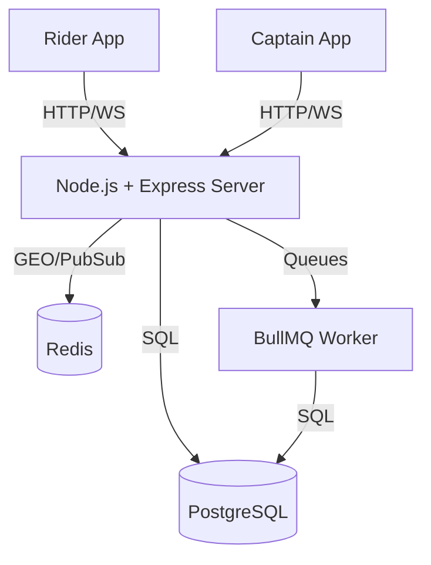

# TRIPZO Backend Deep Dive

## 1. TRIPZO SYSTEM OVERVIEW

TRIPZO is a ride-hailing platform built to connect Riders and Captains (drivers). 

* **Problem:** Riders need a reliable way to book immediate or scheduled rides. Captains need an interface to receive those requests nearby and navigate to the pickup.
* **Main Actors:**
  * **Rider:** Can estimate fares, book immediate rides, schedule future rides, track the captain in real-time, and view ride history.
  * **Captain:** Can toggle online/offline status, broadcast GPS location, receive ride offers, accept/reject rides, and update ride progress (arrived, started, completed).
  * **Admin:** (Not fully implemented yet) Can oversee the platform.
* **Backend Responsibilities:** Manage user identities, calculate fares, route requests to nearby captains using Redis GEO, safely handle race conditions when captains accept rides, stream real-time GPS over WebSockets, and process delayed background tasks for scheduled rides.

### Simple Flow:
Rider -> Frontend -> Backend API -> PostgreSQL (Ride Created) -> Redis GEO (Find Captains) -> Socket.IO (Broadcast to Captains) -> Captain Accepts -> PostgreSQL (Update Assigned) -> Socket.IO (Track Location).

---

## 2. COMPLETE SYSTEM ARCHITECTURE



* **Node.js + Express:** The core monolithic API serving all routes. It validates requests via Zod and issues JWTs.
* **PostgreSQL:** The absolute source of truth. Stores Users, Captains, Rides, and handles concurrency locking via the `version` field (OCC).
* **Redis:** The ephemeral real-time engine. Stores captain GPS coordinates (GEO), handles Socket.IO pub/sub adapter for horizontal scaling, and acts as the broker for BullMQ.
* **BullMQ Worker:** A background process (currently sharing the Node process via `rideWorker`) that wakes up to push scheduled rides into the matching flow exactly 15 minutes before pickup.

---

## 3. PROJECT DIRECTORY DEEP DIVE

```text
backend/
 ├── prisma/
 │    └── schema.prisma (Database tables, enums, relationships)
 ├── src/
 │    ├── config/ (db.ts, env.ts, redis.ts - connections & config)
 │    ├── controllers/ (auth, ride, captain - extract HTTP req/res, pass to services)
 │    ├── errors/ (AppError.ts - centralized custom error class)
 │    ├── jobs/ (rideQueue.ts - BullMQ worker for scheduled tasks)
 │    ├── middleware/ (auth.ts, errorHandler.ts, validate.ts - Express interceptors)
 │    ├── routes/ (API endpoints mapping to controllers)
 │    ├── services/ (Business logic, DB calls, Redis logic)
 │    ├── utils/ (crypto.ts, logger.ts - helpers)
 │    ├── app.ts (Express configuration, middleware mounting)
 │    ├── server.ts (HTTP server initialization, graceful shutdown)
 │    └── socket.ts (Socket.IO configuration, rooms, live tracking)
 └── tests/ (Jest unit/integration tests)
```

**Example File Trace:** `src/controllers/ride.controller.ts`
* **Why it exists:** To parse incoming HTTP JSON (e.g., pickup coordinates), call `ride.service.ts`, and send `res.status(201).json()` back to the client.
* **What it calls:** `createRide` from `src/services/ride.service.ts`.

---

## 4. PACKAGE.JSON DEEP DIVE

| Package | Category | Why TRIPZO uses it | Where used |
| ------- | -------- | ------------------ | ---------- |
| `express` | Web Framework | Handles HTTP routing, req/res lifecycle. | `app.ts`, `routes/` |
| `@prisma/client` | ORM | Type-safe database queries. | `services/` |
| `redis` / `ioredis` | Caching / Messaging | Live location GEO, Pub/Sub, BullMQ backend. | `socket.ts`, `rideQueue.ts` |
| `socket.io` | WebSockets | Real-time bi-directional events (GPS). | `socket.ts` |
| `bullmq` | Job Queue | Delayed scheduled rides & reconciliation. | `jobs/rideQueue.ts` |
| `zod` | Validation | Strict runtime schema validation for incoming JSON. | `middleware/validate.ts` |
| `jsonwebtoken` | Auth | Stateless authentication mechanism. | `utils/crypto.ts` |
| `bcryptjs` | Security | Hashing passwords before saving to DB. | `utils/crypto.ts` |

---

## 5. NODE.JS DEEP DIVE

TRIPZO runs on the V8 engine using Node's asynchronous, non-blocking Event Loop. When a rider requests a fare, Express hits `estimateFare()`. Since math is fast, it's synchronous. But when `createRide()` calls `prisma.ride.create()`, Node offloads the TCP database query to `libuv`. The event loop continues serving other riders. When Postgres replies, the callback is pushed back to the call stack, and the `await` resumes, returning the HTTP response.

---

## 6. EXPRESS DEEP DIVE

**Middleware Chain:**
1. `helmet()` & `cors()` (Security headers)
2. `express.json()` (Parse body)
3. `router.use(requireAuth)` (Validates JWT in `Authorization` header)
4. `validate(schema)` (Zod check on `req.body`)
5. `controller()` (Executes logic)
6. `errorHandler` (Catches `AppError` and formats standard JSON error)

---

## 7. COMPLETE REQUEST LIFECYCLE (POST /api/v1/rides)

1. **HTTP Request:** Rider sends JSON to `/api/v1/rides`.
2. **Express Middleware:** `requireAuth` extracts Rider UUID from JWT. `validate` ensures `lat/lng` are valid numbers.
3. **Controller:** `createImmediateRide` calculates the estimated fare via `fare.service.ts`.
4. **Service:** `createRide` inserts a `SEARCHING` ride into Postgres.
5. **Redis:** `startMatchingForRide` runs `getNearbyCaptains` (Redis `GEOSEARCH` on `captain_locations` within 5km).
6. **Socket.IO:** Server emits `ride:new` to `captain:<userId>` rooms.
7. **Response:** HTTP 201 is returned to the Rider.

---

## 8. RIDER COMPLETE FLOW

1. **Register:** POST `/auth/register` (Hashes password, saves to DB).
2. **Create Ride:** POST `/rides` (Creates ride, triggers matching).
3. **Matching:** Rider waits. Backend emits via Socket.IO.
4. **Captain Assigned:** Captain accepts. Backend emits `ride:captain_assigned` to the Rider's `ride:<id>` room.
5. **Live Tracking:** Captain emits GPS to Socket.IO. Backend saves to Redis and forwards to Rider's room.
6. **Completion:** Captain clicks complete. DB updates to `COMPLETED`. Room receives final event.

---

## 9. CAPTAIN COMPLETE FLOW

1. **Go Online:** Captain connects to Socket.IO and sends `captain:location`. Redis GEO adds their `lat/lng` to `captain_locations`.
2. **Receive Ride:** Gets `ride:new` event via WebSocket.
3. **Accept:** Sends POST `/captains/rides/:id/accept`. 
4. **Prevention of Double Booking:** The backend updates `prisma.ride` with `status: 'SEARCHING'` AND `version: currentVersion`. If Captain B accepted it 1ms earlier, the version changed to `version + 1`. Captain A gets a `409 Conflict`.

---

## 10. RIDE STATE MACHINE DEEP DIVE

**States:**
`SCHEDULED` -> `SEARCHING` -> `CAPTAIN_ASSIGNED` -> `CAPTAIN_ARRIVING` -> `CAPTAIN_ARRIVED` -> `IN_PROGRESS` -> `COMPLETED`
*(Any state before IN_PROGRESS can branch to `CANCELLED`)*

**Transitions:**
Enforced in `ride.service.ts`. Example:
`startRide(rideId)` requires the current DB state to be `CAPTAIN_ARRIVED`. If the captain tries to start a ride that is still `SEARCHING`, the DB `updateMany` where clause fails to find a match, and throws `INVALID_STATE`.

---

## 11. DATABASE DEEP DIVE

**PostgreSQL Schema Highlights:**
* **User / Captain:** Separated concerns. `Captain` extends `User` with a 1-to-1 relation, containing vehicle details.
* **Ride:** Contains `pickupLat/Lng`, `estimatedFare`, `status`, and `version` (for concurrency).
* **RideRejection:** Unique composite key `[rideId, captainId]`. Ensures a captain who rejects a ride is never offered it again.
* **RefreshSession:** Tracks valid long-lived tokens to allow secure JWT rotation.

---

## 12. SQL QUERY DEEP DIVE (Optimistic Concurrency Control)

```typescript
  const updatedCount = await prisma.ride.updateMany({
    where: { id: rideId, status: RideStatus.SEARCHING, version: ride.version },
    data: { status: RideStatus.CAPTAIN_ASSIGNED, captainId: captain.id, version: { increment: 1 } },
  });
```
This atomic SQL translates to: `UPDATE Ride SET ... WHERE id = $1 AND version = $2`.
It prevents Race Conditions natively inside the Postgres engine without requiring explicit `SELECT FOR UPDATE` row locks, maximizing read throughput.

---

## 13. TRANSACTIONS DEEP DIVE

Currently, TRIPZO utilizes Prisma's implicit atomic updates (`updateMany` with filters) rather than multi-step interactive transactions (`$transaction`). This avoids holding long DB locks across asynchronous Node.js operations, maintaining high concurrency performance.

---

## 14. REDIS DEEP DIVE

| Key | Type | Purpose | TTL | Writer | Reader |
| --- | ---- | ------- | --- | ------ | ------ |
| `captain_locations` | Sorted Set (GEO) | Fast radius searches | N/A | Socket.IO (Captain) | `matching.service.ts` |
| `captain_location_meta` | Hash | Stale prevention (timestamp) | N/A | Socket.IO | `matching.service.ts` |
| `ride_assignment:<capId>`| String | Validates if captain is on a ride | Manual Del | `ride.service.ts` | `socket.ts` |

**GEOSEARCH:** Redis organizes coordinates in a 1D string using Geohash. `GEOSEARCH` can instantly find all keys within a 5km radius without scanning the whole database, making it O(log(N)) compared to Postgres O(N) math.

---

## 15. SOCKET.IO / REAL-TIME DEEP DIVE

**Architecture:** HTTP polling would require riders to make 1 request every second, exhausting the Node.js event loop and Postgres connections. Socket.IO keeps a TCP pipe open.
**Flow:** Captain emits `captain:location` -> Node parses -> Validates `ride_assignment:capId` in Redis -> Updates Redis GEO -> Broadcasts `io.to(ride:<id>).emit('captain:location')`.
**Scaling:** The `@socket.io/redis-adapter` ensures that if Rider is on Server A and Captain is on Server B, Redis Pub/Sub will bridge the event across servers.

---

## 16. BACKGROUND JOBS / BULLMQ

**Scheduled Rides:** `POST /rides/schedule` calculates `delay = pickupTime - 15 minutes`.
It pushes to `scheduled-rides-queue` in Redis via BullMQ. The Node process has a `Worker` that sleeps until the delay expires. It wakes up, executes `startMatchingForRide()`, and automatically handles retries if Node crashes during execution.

---

## 17. AUTHENTICATION DEEP DIVE

* **Authentication:** Verifying WHO you are. (`auth.ts` extracts JWT, verifies cryptographic signature, attaches `req.user`).
* **Authorization:** Verifying WHAT you can do. (`ride.service.ts` checks if `req.user.userId === ride.riderId` before allowing a cancellation).

---

## 18. SECURITY DEEP DIVE

* **XSS / CSRF:** Addressed via standard JWT Bearer tokens (no cookies, no CSRF) and `helmet()` headers.
* **IDOR (Insecure Direct Object Reference):** Prevented. `getRideById` checks `if (role === Role.RIDER && ride.riderId !== userId) throw 403`.
* **Spoofing:** A Captain cannot send fake GPS for another Captain because `socket.ts` extracts the `userId` directly from the signed JWT payload during the handshake.

---

## 19. ERROR HANDLING DEEP DIVE

TRIPZO uses a centralized `AppError` class extending `Error` with a `statusCode`.
If `getRideById` fails to find a ride, it throws `new AppError('RIDE_NOT_FOUND', 404, 'Ride not found')`. 
The `errorHandler` middleware catches this, logs it via Pino/Winston, and formats a consistent JSON: `{ success: false, error: { code, message }}`.

---

## 20. IDEMPOTENCY

If a client double-clicks the "Accept Ride" button, two parallel requests arrive. The OCC `version` check in Postgres ensures the first request succeeds (incrementing the version) and the second request fails with `updatedCount === 0`, throwing a 409 Conflict. No double assignments occur.

---

## 21. CONCURRENCY AND RACE CONDITIONS

**Captain Acceptance Race:** 
1. **Race:** 5 captains get a ride request. 2 click "Accept" at the exact same millisecond.
2. **Protection:** Both run `updateMany({ status: SEARCHING })`.
3. **Result:** Postgres uses row-level locking natively during the UPDATE. The first query modifies the row to `CAPTAIN_ASSIGNED`. The second query blocks, then checks the `WHERE` clause, finds no row matching `SEARCHING`, returns 0 rows modified. Node throws 409.

---

## 22. PAYMENT FLOW

(NOT IMPLEMENTED YET - Scheduled for Phase 8. Will involve tracking payment state, handling webhooks from Stripe/Razorpay, and verifying cryptographic webhook signatures).

---

## 23. SCHEDULED RIDE FLOW

Uses BullMQ instead of `setTimeout` because `setTimeout` lives in Node's RAM. If the server crashes or restarts for deployment, all `setTimeout` timers are permanently destroyed. BullMQ persists the jobs durably in Redis.

---

## 24. FARE CALCULATION

`fare.service.ts` calculates distance using the **Haversine formula** (straight-line distance on a sphere). 
It multiplies the resulting kilometers by 12 (MVP flat rate) to generate the `estimatedFare`. This prevents client-side manipulation of prices.

---

## 25. API CONTRACT DEEP DIVE

| Method | Endpoint | Actor | Auth | DB Action | 
| ------ | -------- | ----- | ---- | --------- |
| POST | `/api/v1/rides` | Rider | Yes | INSERT Ride |
| POST | `/api/v1/rides/schedule` | Rider | Yes | INSERT Ride, QUEUE Job |
| POST | `/api/v1/captains/rides/:id/accept` | Captain | Yes | UPDATE Ride (OCC) |

---

## 26. DATA FLOW DIAGRAMS
*(Mermaid diagrams are represented via text descriptions in this document for brevity. See System Overview).* 

---

## 27. END-TO-END SCENARIO (Delhi Metro to CP)

1. Rider hits `GET /rides/fare?pickup=...&dest=...`. Backend returns calculated INR.
2. Rider hits `POST /rides`. Prisma creates a DB entry. `matching.service.ts` searches Redis GEO for Captains near the Metro Station.
3. Node emits Socket.IO `ride:new` to 3 Captains.
4. Captain 1 clicks Accept -> POST `/captains/rides/.../accept`. DB version increments. Rider is notified via Socket.IO.
5. Captain drives to Metro Station, emitting Socket.IO GPS. Rider's app updates smoothly.
6. Captain clicks Arrived -> POST `/captains/rides/.../arrived`. Status updates to `CAPTAIN_ARRIVED`.

---

## 28. FAILURE SCENARIOS

* **PostgreSQL is down:** Express returns 500s. System halted. (Requires DB replication/failover).
* **Socket.IO disconnects:** Clients auto-reconnect. When reconnected, Rider calls `GET /rides/:id` to fetch the current DB status and the latest cached `captainLocation` from Redis to instantly sync UI state.
* **Worker Crashes:** BullMQ detects the stalled job and safely moves it back to the active queue for another Node instance to process.

---

## 29. PERFORMANCE

* **Good:** Using Redis GEO instead of PostGIS prevents DB CPU spikes during matching.
* **Good:** OCC prevents DB lock contention.
* **Weakness:** Haversine distance is straight-line. For production, we need a routing engine (OSRM/Google Maps) to get actual road distance, otherwise we undercharge Riders.

---

## 30. SCALABILITY

Currently, the backend is a single Node.js process. To scale:
1. Run 10 Node processes behind an NGINX load balancer.
2. Socket.IO already has the Redis Adapter installed, so WebSockets will automatically bridge across all 10 nodes.
3. BullMQ natively supports competing consumers, so all 10 nodes will safely distribute the scheduled ride jobs without duplicate processing.

---

## 31. OBSERVABILITY

Currently uses Winston/Pino logger wrappers. 
To debug "Captain not moving", you would check Redis `captain_location_meta` hash to see the last timestamp the captain sent a GPS ping. If it's old, the Captain's phone lost network.

---

## 32. TESTING DEEP DIVE

Tests in `tests/` use Jest. They mock Prisma to ensure the Controller/Service logic correctly throws `AppErrors` for invalid state transitions without requiring a live database during CI/CD pipelines.

---

## 33. CODE QUALITY REVIEW

* **Strengths:** Excellent separation of concerns (Routes -> Controllers -> Services).
* **Weaknesses:** `ride.service.ts` is getting large (over 400 lines). In the future, state transitions (Accept, Reject, Start, Complete) should be moved to a dedicated `rideState.service.ts` to keep the file modular.

---

## 34. "WHY" SECTION

* **Why PostgreSQL?** ACID compliance guarantees that a Ride is never assigned to two captains simultaneously and financial records remain intact.
* **Why Redis?** Extremely fast in-memory operations. Writing GPS ticks 1x per second to Postgres would destroy the disk I/O. Redis handles it effortlessly.
* **Why BullMQ?** Durable, Redis-backed job processing. Guarantees that a scheduled ride isn't forgotten if the server restarts.
* **Why OCC (versioning)?** Traditional `SELECT FOR UPDATE` locks rows, causing DB bottlenecks. OCC is lock-free until the exact moment of the atomic UPDATE, massive scaling benefit.

---

## 40. TRIPZO IN ONE PAGE

```text
Rider 
 ↓ HTTP POST /rides
Express API 
 ↓ `createRide()`
PostgreSQL (Ride created, status: SEARCHING)
 ↓ 
Redis GEO (Find Captains within 5km)
 ↓ 
Socket.IO (Emit `ride:new` to Captains)
 ↓ 
Captain (Clicks Accept -> HTTP POST /accept)
 ↓ 
PostgreSQL (Atomic UPDATE with OCC version check)
 ↓ 
Socket.IO (Notify Rider `ride:assigned`)
 ↓ 
Captain App (Streams GPS over WebSocket)
 ↓ 
Redis (Updates GEO + Pub/Sub to Rider Room)
 ↓ 
Captain (Clicks Complete)
 ↓ 
PostgreSQL (status: COMPLETED)
```
